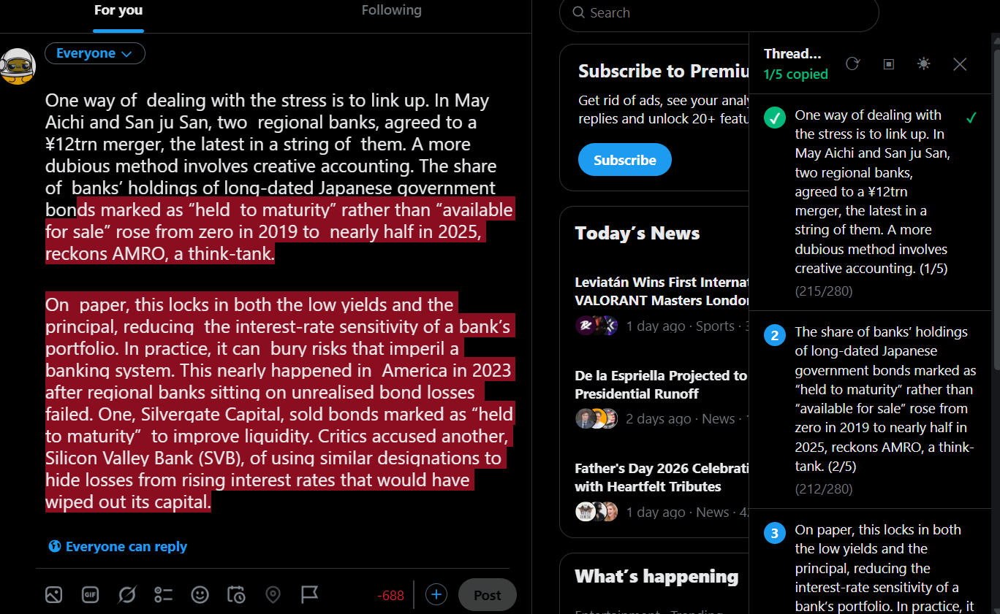

# X-Split



Firefox + Chrome extension. Split long X posts into threads. Free.

## How it works

1. Install the extension
2. Go to x.com and open the compose box
3. Type past 280 characters. The sidebar appears.
4. Copy each chunk and paste into X.

No accounts. No API keys. No config screens.

## Features

**Auto-split on input.** The sidebar shows up the moment your text hits the character limit. Edit or delete text, the chunks update.

**Sentence-boundary splitting.** Breaks at periods, exclamation marks, and question marks. Falls back to word breaks. Never cuts mid-word.

**URL-aware counting.** URLs count as 23 characters (matches X's t.co spec). The splitter never breaks a URL across two chunks.

**Numbered chunks.** Each post gets `(1/5)`, `(2/5)` and so on. Choose parenthesis, brackets, or slash format in settings.

**Fill mode (optional).** Fills each chunk to the max character limit. Off by default (sentence breaks are cleaner).

**Re-split.** Edit your text after splitting. Click the button to re-split.

**Dark mode.** Follows your system preference. No toggle needed.

**Collapsible sidebar.** Click X to hide the sidebar. A floating tab stays on the right edge to reopen it.

## Install

**Firefox:** [Firefox Add-ons](https://addons.mozilla.org) (search for X-Split)

**Chrome:** [Chrome Web Store](https://chromewebstore.google.com) (search for X-Split)

Links go live after store approval.

## Manual install (development)

No build step.

```sh
git clone https://github.com/YOUR_USERNAME/x-split.git
```

- **Firefox:** Open `about:debugging` -> This Firefox -> Load Temporary Add-on -> select `extension/manifest.json`
- **Chrome:** Open `chrome://extensions` -> Developer mode -> Load unpacked -> select `extension_chrome/`

## Project structure

```
extension/          Firefox build
extension_chrome/   Chrome build
  manifest.json     Extension config (MV3)
  content.js        Split algorithm + sidebar UI
  content.css       Sidebar styles
  popup/            Settings popup
  icons/            SVG (Firefox) / PNG (Chrome)
build.ps1           Generates store ZIPs
docs/               Product docs + privacy policy
```

## License

MIT
